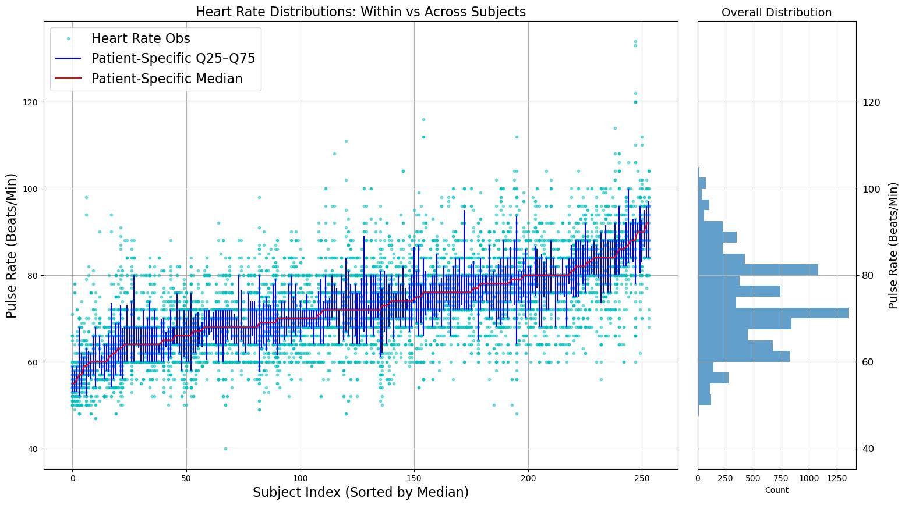

# ADaM Demo – Loading Lab

This folder contains a demo for working with **CDISC ADaM (Analysis Data Model)** datasets.  
It is part of the **Loading Lab** repository, which provides lightweight demos for different types of lab and biomedical data (microscopy, RNAseq, flow cytometry, mass spec, SDTM, etc.).  
While ADaM originates in the clinical trials and regulatory submission world, it is included here because:

1. ADaM builds directly on SDTM and provides **analysis‑ready datasets**.  
2. Understanding ADaM is increasingly important for connecting clinical trial data with other data sources.  
3. Side‑by‑side with the **SDTM demo**, this helps illustrate the flow from collected tabulations (SDTM) to analysis datasets (ADaM).  
4. I'm a mere mortal and didn't want to create another small repo to take care of.

---

## Background

The **Clinical Data Interchange Standards Consortium (CDISC)** defines two foundational models for clinical trial data:  

- **SDTM (Study Data Tabulation Model)** – standardized format for raw collected data.  
- **ADaM (Analysis Data Model)** – derived datasets structured to support statistical analysis.  

This demo uses the **CDISC Pilot 01 (updated 2018)** ADaM data, made publicly available by PHUSE:  
<https://github.com/phuse-org/phuse-scripts/blob/master/data/adam/cdiscpilot_update1.zip>

The original pilot project is described here:  
<http://www.cdisc.org/sdtmadam-pilot-project>
 
---

## Data Contents

The raw datasets are provided in **SAS XPORT (.xpt)** format – the FDA‑required standard for electronic submission.  
They include subject‑level data, adverse events, labs, vitals, questionnaires, and survival analysis datasets.  

Example files in `data/raw/` include:

- `adsl.xpt` – Subject‑Level Analysis Dataset  
- `adae.xpt` – Adverse Events Analysis Dataset  
- `advs.xpt` – Vital Signs Analysis Dataset  
- `adlbc.xpt`, `adlbh.xpt`, `adlbhy.xpt` – Laboratory Analysis Datasets (Chemistry, Hematology, Hy’s Law)  
- `adtte.xpt` – Time‑to‑Event Analysis Dataset (e.g. survival)  
- `adadas.xpt`, `adcibc.xpt`, `adnpix.xpt` – Questionnaire Analysis Datasets  
- `define.xml` – Metadata describing all datasets and variables  

The `figures/` folder contains sample outputs created by the demo notebook, such as dataset previews, patient counts, and summaries of vitals and labs.

---

## How to Get the Data

You can download the updated **CDISC Pilot 01 ADaM data** directly from PHUSE:  
<https://github.com/phuse-org/phuse-scripts/blob/master/data/adam/cdiscpilot_update1.zip>

You do *not* need to download the entire PHUSE repository. You can extract just the ADaM folder (`cdiscpilot01`) using Subversion or a zip download.

---

## Notebook Workflow

The notebook [`01_load_adam_xpt_files.ipynb`](notebooks/01_load_adam_xpt_files.ipynb) demonstrates how to:

1. Load `.xpt` files into Python with `pyreadstat`.  
2. Inspect the structure of common ADaM datasets.  
3. Generate preview tables and plots, for example:  

### Preview of ADLBH Hematology Labs


### Preview of ADLBC Clinical Chemistry Labs


### Patients per Treatment Arm by Site


### Vital Sign Parameters Available in ADVS


### Heart Rate Quantiles + Histogram


### Subject Vital Signs Over Time


### Laboratory Parameters Available in ADLBC


### Bilirubin Quantiles + Histogram


---

## Dependencies

To install the environment, use the included `environment.yml` file:

```bash
conda env create -f environment.yml
conda activate cdisc-adam-demo
```

This environment includes the main libraries for working with XPT files, dataframes, and plots.

---

## Relation to SDTM Demo

This ADaM demo complements the **SDTM demo** folder within the Loading Lab repository.  
Together they highlight the workflow of clinical trial data:  

- **SDTM** – standardized *tabulations* of collected data.  
- **ADaM** – derived *analysis datasets* built to support statistical modeling and inference.  

Working through both demos provides a clear picture of how raw trial data becomes analysis‑ready.

---

## Disclaimer

⚠️ **Educational Use Only**  
This demo is provided for learning purposes only.  
- It is **not** suitable for regulatory submission.  
- It does not generate CDISC‑compliant tables, listings, or figures (TLFs).  
- The goal is simply to show where to obtain example ADaM data and how to load it into Python.

---

## References & Resources

- [CDISC ADaM Standards](https://www.cdisc.org/standards/foundational/adam)  
- [CDISC SDTM Standards](https://www.cdisc.org/standards/foundational/sdtm)  
- [PHUSE ADaM Pilot Data](https://github.com/phuse-org/phuse-scripts/tree/master/data/adam)  
- [FDA Study Data Standards Resources](https://www.fda.gov/industry/study-data-standards-resources)

